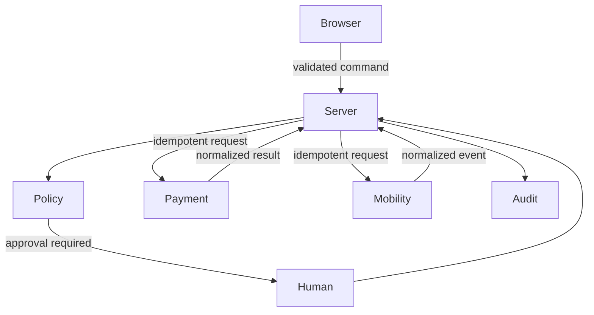

# Architecture

ShiftSecure is a modular Next.js monolith: thin pages and route handlers, framework-independent domain rules, typed provider ports, and a future Prisma persistence layer. The “agent” is a bounded command orchestrator; an optional LLM may summarize an already-made structured decision but can never rank workers, approve, spend, book, or set state.

Money uses integer cents. Every mutation should carry actor, organization, correlation ID, and operation key. The durable design uses optimistic rescue versions, unique idempotency records, unique provider operation keys, and ordered audit events. A provider call must never occur inside a database transaction: persist an intent/outbox item, call externally, then finalize or mark uncertain.

## Trust boundaries

Invalid transitions, stale provider events, missing policy, ambiguous responses, and bypass attempts fail closed.
