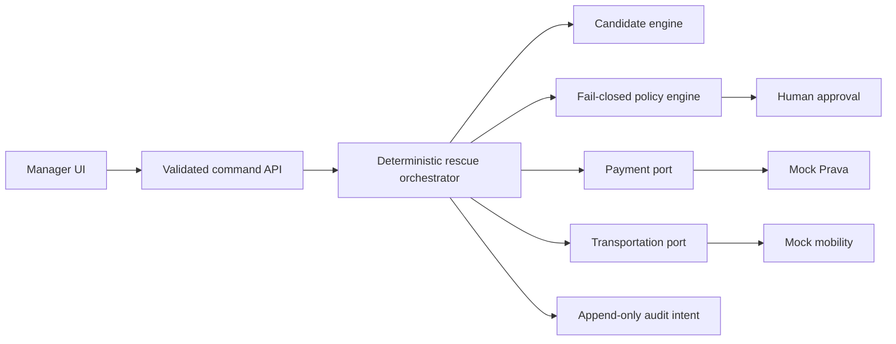
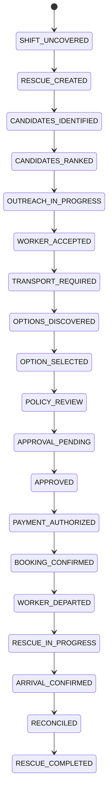

# ShiftSecure

ShiftSecure is an agentic workforce-continuity MVP that fills an urgent vacancy, secures employer-funded transportation, enforces spending policy, and verifies that the replacement worker arrives.

> The included demo uses simulated workers, outreach, payment authorization, and transportation. It never represents a mock transaction as real.

## Why it exists

Scheduling tools often stop at “shift accepted.” ShiftSecure treats **qualified worker arrival confirmed** as the outcome. A bounded, deterministic orchestrator evaluates job-relevant facts, applies policy before every commercial action, pauses for human approval, and records an auditable event trail. It is not a rideshare operator, payroll system, or autonomous hiring authority.

## Demo

```bash
npm install
copy .env.example .env
npm run dev
```

Open `http://localhost:3000/demo`. The UI uses the demo identity `manager@shiftsecure.demo`; production authentication is not implemented.


Harbor View Senior Living has an uncovered 7:00 AM CNA shift. Maria Santos is qualified and available but needs a ride. ShiftSecure prefers a $36 UberX mock option arriving at 6:42 AM over a cheaper late option. Because $36 exceeds the $30 threshold, the workflow requires manager approval before a restricted $40 mock authorization and mock booking.

Available deterministic paths:

- successful rescue through reconciled receipt;
- payment rejection, with booking blocked;
- provider cancellation, returning safely to option discovery.

## Architecture





The domain and provider contracts are framework-independent. Browser clients request commands; they never submit a target state. External providers return `success`, `declined`, `retryable_error`, or `uncertain`, and uncertainty never becomes success. Idempotency keys prevent repeated mock authorizations and bookings.

## Commands

```bash
npm run lint
npm run typecheck
npm run test
npm run test:integration
npm run test:all
npm run test:e2e
npm run build
```

## Integrations

Mock Prava and mobility providers power the working demo. `PravaPaymentProvider`, `UberGuestRidesProvider`, and `LyftConciergeProvider` are disabled adapter boundaries—not claims of verified live connectivity. Transportation business-account billing and Prava authorization remain distinct records and must be reconciled.

## Safety

- deterministic hard eligibility gates use only job-relevant data;
- policy is separate from orchestration and fails closed;
- cost above threshold requires a human;
- duplicate operations return the original mock result;
- live provider uncertainty never produces success;
- no card number, CVV, token, or raw provider payload is logged;
- MOCK/SIMULATED labels remain visible.

## Current limitations

This hackathon build has no production authentication, durable running workflow store, real outreach, live provider credentials, webhooks, rate limiter, hosted database, or compliance certification. Prisma models describe the durable design, but the interactive demo is deterministic client state. Before production, use PostgreSQL, signed provider webhooks, an outbox, secure sessions and RBAC, encryption, retention controls, monitoring, and independent security/compliance review.

See [architecture](ARCHITECTURE.md), [scope](HACKATHON_SCOPE.md), [security](SECURITY.md), [privacy](PRIVACY.md), [testing](TESTING.md), [deployment](DEPLOYMENT.md), and [judge script](DEMO_SCRIPT.md).
