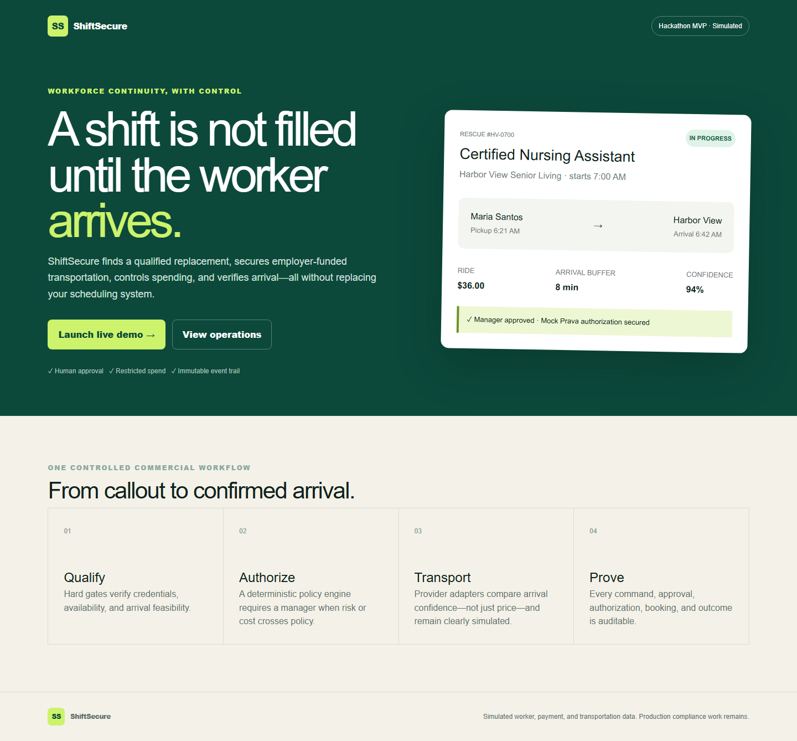
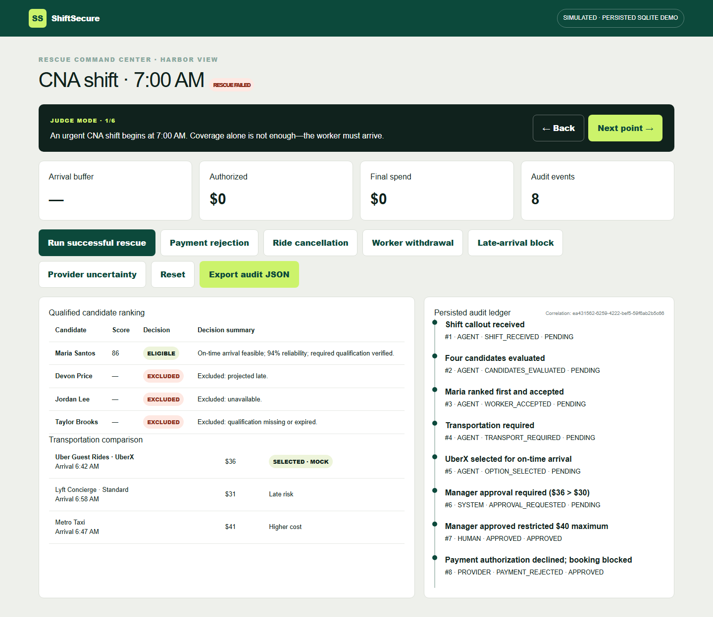
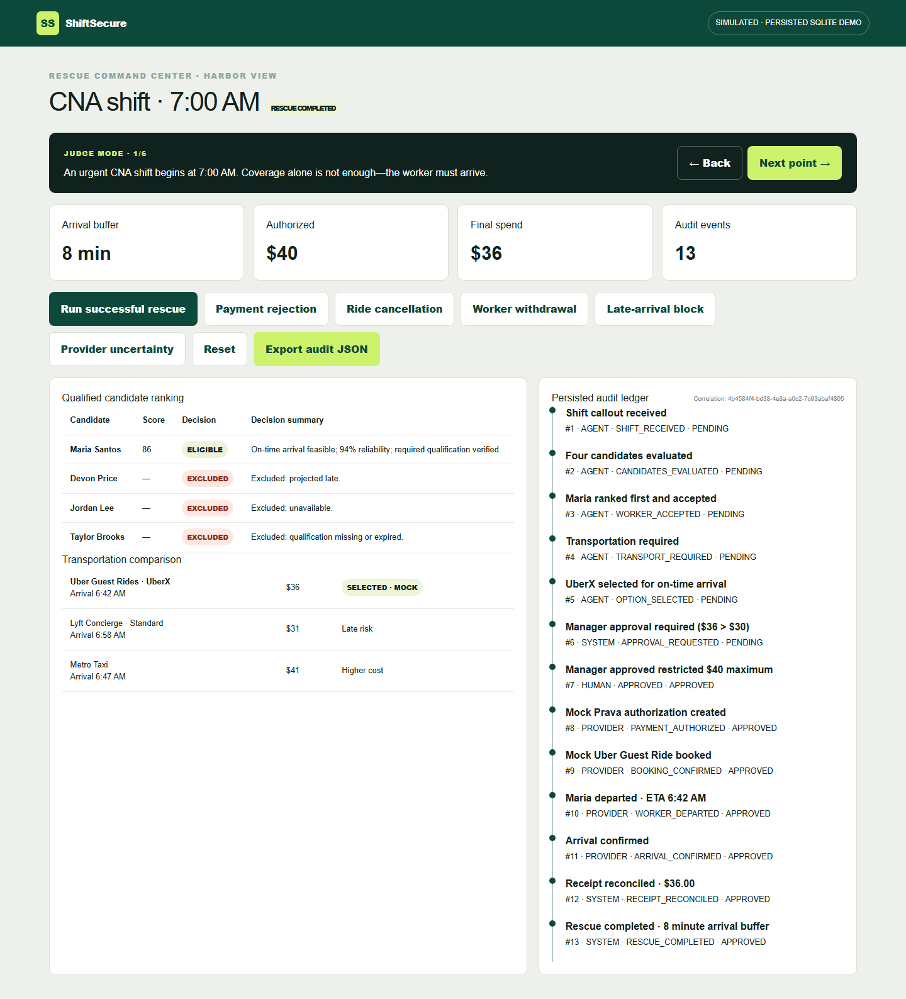
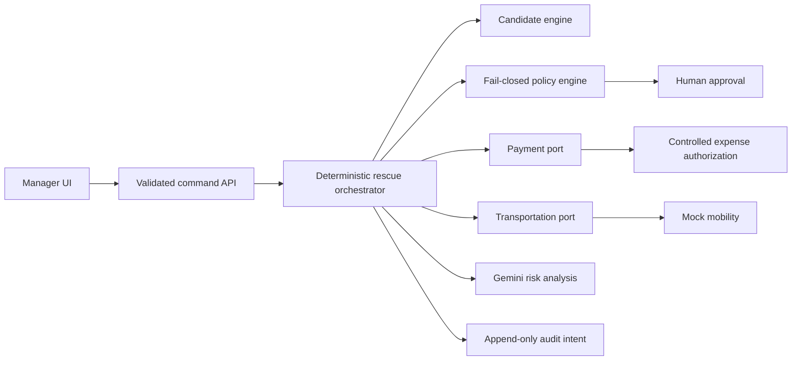
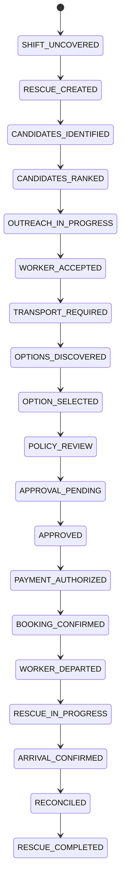

# ShiftSecure

ShiftSecure is an AI-native workforce-continuity product that helps essential-service employers fill an urgent vacancy, resolve transportation barriers, maintain human control, and verify that the replacement worker arrives.

> The included demo uses simulated workers, outreach, payment authorization, and transportation. It never represents a mock transaction as real.

## Why it exists

Scheduling tools often stop at “shift accepted.” ShiftSecure treats **qualified worker arrival confirmed** as the outcome. A bounded, deterministic orchestrator evaluates job-relevant facts, applies policy before every commercial action, pauses for human approval, and records an auditable event trail. It is not a rideshare operator, payroll system, or autonomous hiring authority.

## Demo

```bash
npm install
copy .env.example .env
npm run dev
```

Open `http://localhost:3000/demo`. The UI uses the demo identity `manager@shiftsecure.demo`; production authentication is not implemented.





Harbor View Senior Living has an uncovered 7:00 AM CNA shift. Maria Santos is qualified and available but needs a ride. ShiftSecure prefers a $36 UberX mock option arriving at 6:42 AM over a cheaper late option. Because $36 exceeds the $30 threshold, the workflow requires manager approval before a restricted $40 mock authorization and mock booking.

Available deterministic paths:

- successful rescue through reconciled receipt;
- payment rejection, with booking blocked;
- provider cancellation, returning safely to option discovery.

## Architecture





The domain and provider contracts are framework-independent. Browser clients request scenarios; they never submit a target state. A server-owned SQLite repository persists state and ordered audit events across refreshes. External providers return `success`, `declined`, `retryable_error`, or `uncertain`, and uncertainty never becomes success. Idempotency keys prevent repeated mock authorizations and bookings.

## Commands

```bash
npm run lint
npm run typecheck
npm run test
npm run test:integration
npm run test:all
npm run test:e2e
npm run build
```

## Gemini and integrations

The official Google Gen AI SDK powers an optional server-side Gemini operations analysis. Configure `GEMINI_API_KEY` for Google AI Studio or `GOOGLE_CLOUD_PROJECT` and `GOOGLE_CLOUD_LOCATION` for Vertex AI. Gemini produces a validated structured risk summary and recommended human action; it cannot change workflow state, employment eligibility, approvals, spending, bookings, or arrival status. When credentials are absent or a request fails, the UI visibly reports a deterministic fallback.

Mobility and expense providers remain mocked in the working demonstration. `UberGuestRidesProvider` and `LyftConciergeProvider` are adapter boundaries, not claims of verified connectivity.

## Safety

- deterministic hard eligibility gates use only job-relevant data;
- policy is separate from orchestration and fails closed;
- cost above threshold requires a human;
- duplicate operations return the original mock result;
- live provider uncertainty never produces success;
- no card number, CVV, token, or raw provider payload is logged;
- MOCK/SIMULATED labels remain visible.

## Current limitations

This prototype has no production authentication, real outreach, live mobility credentials, webhooks, rate limiter, hosted database, customers, revenue, or compliance certification. The persisted SQLite workflow is intentionally single-node demo infrastructure. Before production, use PostgreSQL, signed provider webhooks, an outbox, secure sessions and RBAC, encryption, retention controls, monitoring, and independent security/compliance review.

See [XPRIZE scope](XPRIZE_SCOPE.md), [architecture](ARCHITECTURE.md), [Google Cloud deployment](GOOGLE_CLOUD_DEPLOYMENT.md), [security](SECURITY.md), [privacy](PRIVACY.md), [testing](TESTING.md), and [demo script](DEMO_SCRIPT.md).

Submission tracking is maintained in [SUBMISSION_CHECKLIST.md](SUBMISSION_CHECKLIST.md). The public pilot templates are available at `/terms`, `/privacy`, and `/acceptable-use`; they require counsel review before real customer onboarding.
